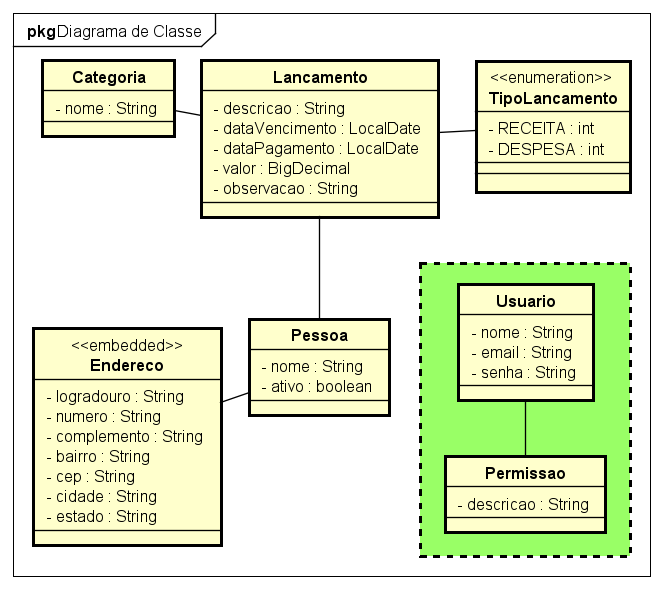
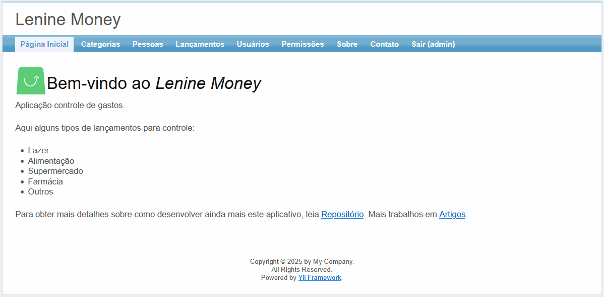

# 💰 Controle de Gastos - CRUD com Yii

 

Este projeto é um CRUD (Create, Read, Update, Delete) básico para controle de gastos, desenvolvido em PHP utilizando o framework Yii 1.1.

## 🚀 Tecnologias Utilizadas

🖥️ PHP (versão 8 ou superior)

🌐 Yii Framework 1.1

🗄️ MySQL (ou outro banco de dados compatível)

🎨 Bootstrap (padrão do Yii) para estilização

## 📌 Funcionalidades

✔️ Cadastro de despesas e receitas ✔️ Listagem de gastos ✔️ Edição e exclusão de registros ✔️ Interface simples e objetiva

## 📂 Estrutura do Projeto

```plaintext
📂 assets
📂 css
📂 images
📂 protected
 ├── 📁 commands
 ├── 📁 components
 ├── 📁 config
 ├── 📁 controllers
 ├── 📁 data
 ├── 📁 extensions
 ├── 📁 messages
 ├── 📁 migrations
 ├── 📁 models
 ├── 📁 runtime
 ├── 📁 tests
 ├── 📁 vendor
 ├── 📁 views
📂 themes
⚙️ .htaccess
📜 index-test.php
📜 index.php
📖 README.md

## 🔧 Como Instalar e Rodar o Projeto

Clone o repositório:

git clone https://github.com/leninenunes/leninemoney.git

Configure o banco de dados em protected/config/database.php.

Execute as migrações na pasta protected/migrations ou crie as tabelas manualmente.

Acesse o projeto no navegador:

http://localhost/leninemoney

## 📊 Diagrama de Classes

O projeto segue uma estrutura organizada baseada em MVC. Abaixo está o diagrama de classes utilizado:



## 🎥 Demonstração



## 📖 Autor

👤 Lenine Nunes

🔗 <a href="https://github.com/leninenunes" target="_blank">GitHub</a>